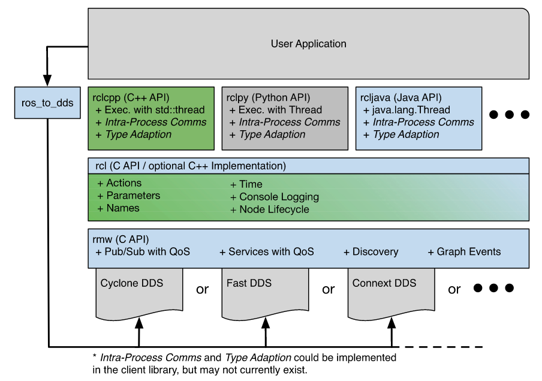

# ROS2

ROS2 is a ground-up redesign of ROS1 that has significant performance and feature upgrade.

## Limitations of ROS1
Originated from 2007 as a research platform. Its features and algorithms are not production grade.
* Performance and Reliability\
TCPROS (bespoke protocol based on TCP/IP).
* Realtime\
No support.
* Multi-robot\
No standard support. Centralized discovery and registration.
* Security\
No built-in security mechanism.
* Multi-platform\
Linux only.
* Microcontroller\
No support.

## Comparison between ROS1 and ROS2

## Main Features of ROS2
ROS2 is based on Data Distribution Service (DDS), an open standard for communications that is used in critical infrastructure such as military, spacecraft, and financial systems. As a result, ROS2 has the following capabilities
* Best-in-class security
* Embedded and realtime support
* Multi-robot communication
* Operation in nonideal network environment

DDS uses UDP, supports distributed discovery, and has built-in security standards.

### Performance and Reliability
### Security
DDS security standard + SROS2
* Authentication
* Encryption
* Access control

### References
[Robot Operating System 2: Design, architecture, and uses in the wild](https://www.science.org/doi/epdf/10.1126/scirobotics.abm6074)
