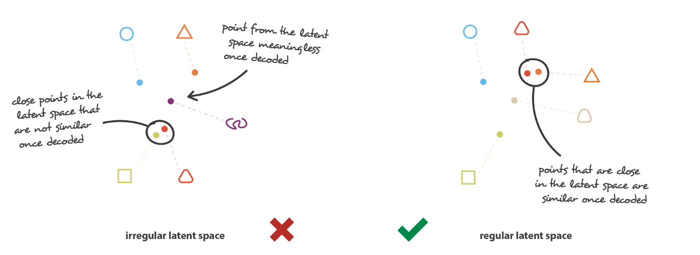
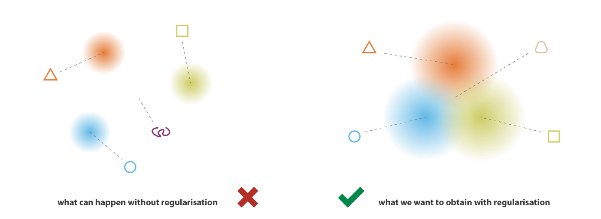

# ROS2

ROS2 is ground-up redesign of ROS1 that has huge performance and feature upgrade.

## ROS1
Originated from 2007 as a research platform. Its features and algorithms are not production grade.
* Performance and Reliability\
TCPROS
* Security\
No built-in security mechanism.
* Multi-robot\
No standard support. Central discovery and registration.
* Realtime\
No support.
* Multi-platform\
Only Linux.
* Microcontroller\
No support.

## Data Generation

**lack of regularity** -- the lack of interpretable and exploitable structures in the latent space.

## Variational Autoencoder

## Regularisation
**continuity** -- two close points in the latent space should not give two completely different contents once decoded.\
**completeness** -- for a chosen distribution, a point sampled from the latent space should give “meaningful” content once decoded.

### References
[Understanding Variational Autoencoders (VAEs)](https://towardsdatascience.com/understanding-variational-autoencoders-vaes-f70510919f73)
