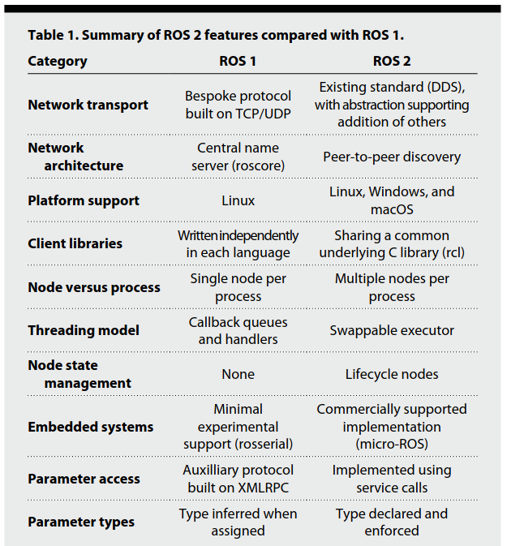

# ROS2

ROS2 is a ground-up redesign of ROS1 that has significant performance and feature upgrade.

## Limitations of ROS1
Originated from 2007 as a research platform. Its features and algorithms are not production grade.
* Performance and Reliability\
TCPROS (bespoke TCP/IP).
* Multi-robot\
No standard support. Centralized discovery and registration.
* Security\
No built-in security mechanism.
* Realtime\
No support.
* Multi-platform\
Linux only.
* Microcontroller\
No support.

## ROS2

### References
[Robot Operating System 2: Design, architecture, and uses in the wild](https://www.science.org/doi/epdf/10.1126/scirobotics.abm6074)
