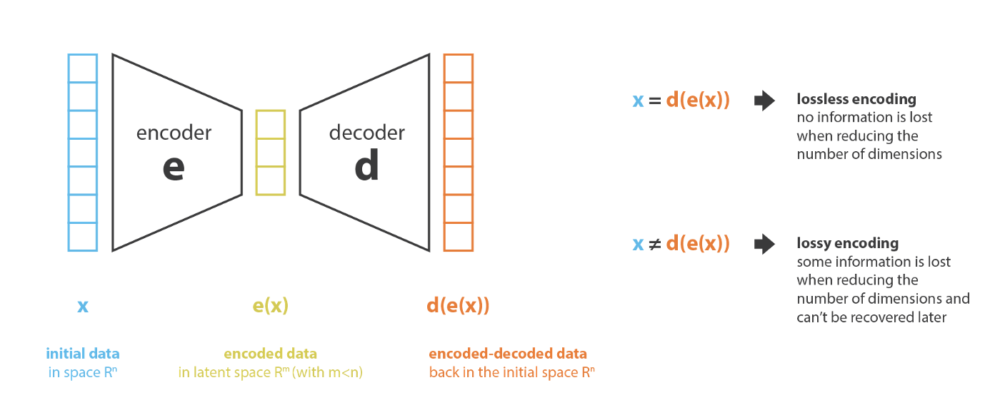
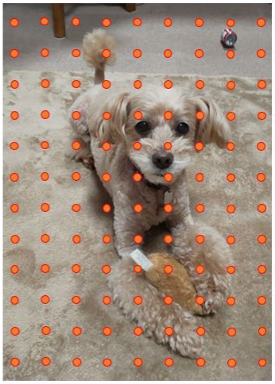
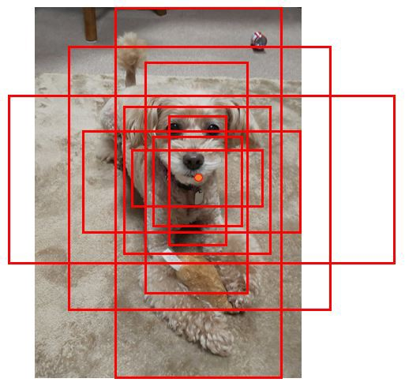
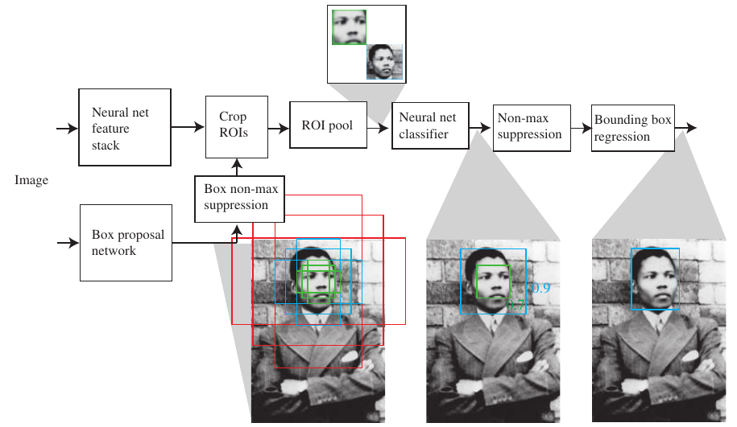

# Variational Autoencoder (VAE)

In a nutshell, a VAE is an autoencoder whose encodings distribution is regularised during the training in order to ensure that its latent space has good properties allowing us to generate new meaningful data.

## Region Proposal Network (RPN)
* Which window on the image should a CNN classifier look at?

**RPN** scores the "objectness" of windows and finds the ones with objects.
- A 3D map encodes a large collection of bounding boxes
- First 2D represent the box center coordinates
- Last dimension represents the box type: **anchor boxes** (small, medium, large) × (wide, square, tall)

sliding windows | anchor boxes
---|---
|

### non-maximum suppresion
There are many similar boxes and we don't want to report all of them.
1. Build a sorted list of all windows with "objectness" score above a threshold.
2. While there are windows in the list, choose the window with the highest score and discard from the list all other largely overlapping windows.

## ROI pooling
ROI's are of different shape and size. CNN prefers images of fixed size. **ROI pooling** extracts equal-length feature vectors from all ROI proposals.\

## Example

### References
[Understanding Variational Autoencoders (VAEs)]([https://www.wireguard.com/quickstart/](https://towardsdatascience.com/understanding-variational-autoencoders-vaes-f70510919f73))
