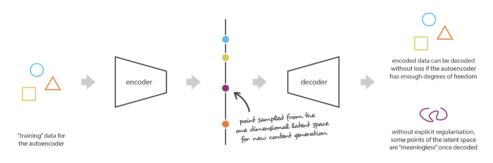

# Variational Autoencoder (VAE)

In a nutshell, a VAE is an **autoencoder** whose encodings distribution is **regularised** during the training in order to ensure that its latent space has **good properties** allowing us to generate new meaningful data.

## Dimensionality Reduction

**principal component analysis** (PCA) -- linear encoder with orthogonal rows and linear decoder.\
**autoencoder** -- encoder and decoder are neural nets with a bottleneck in between.

## Data Generation

**lack of regularity** -- the lack of interpretable and exploitable structures in the latent space.

## Variational Autoencoder

### References
[Understanding Variational Autoencoders (VAEs)](https://towardsdatascience.com/understanding-variational-autoencoders-vaes-f70510919f73)
