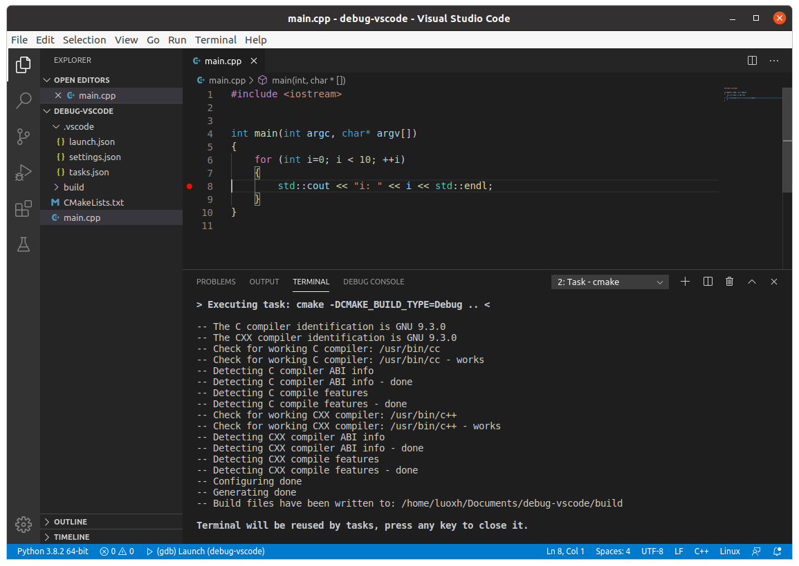
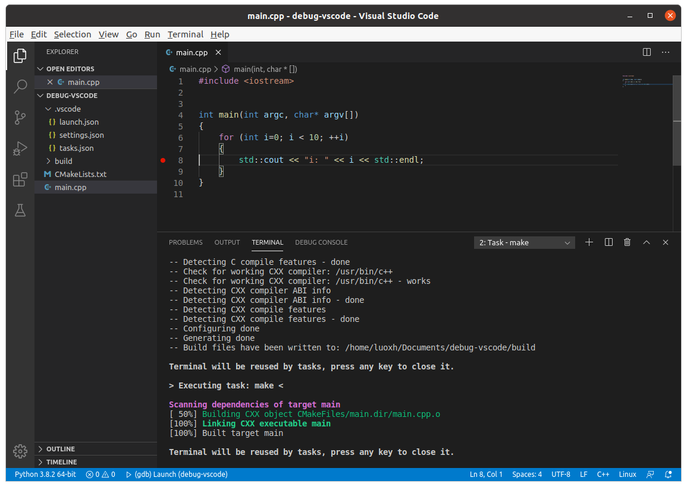
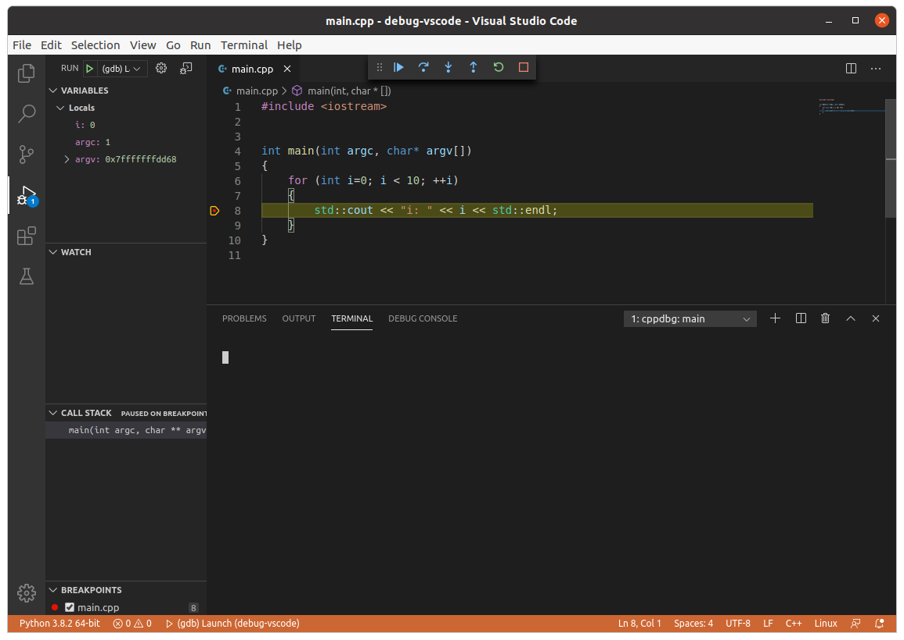

# Debug C++ Programs with GDB in VS Code

This note goes through a trivial example of debugging C++ programs in VS Code.

## Files of the Project
Suppose we have a trivial project like the following:
```
myproject/
    .vscode/
        tasks.json
        launch.json
    build/
    CMakeLists.txt
    main.cpp
```
It contains:
* The source code file: main.cpp
```C++
#include <iostream>


int main(int argc, char* argv[])
{
    for (int i=0; i < 10; ++i)
    {
        std::cout << "i: " << i << std::endl;
    }
}
```
* The CMake file: CMakeLists.txt
```cmake
cmake_minimum_required(VERSION 3.5)
project(myproject VERSION 1.0)

## Compile as C++11
set (CMAKE_CXX_STANDARD 11)
set (CMAKE_CXX_STANDARD_REQUIRED YES)

	
# Build the executable
add_executable (main main.cpp)
```
The following file defines the building tasks.
* tasks.json
```json
{
    "version": "2.0.0",
    "tasks": 
    [
        {
            "type": "shell",
            "label": "cmake",
            "command": "cmake",
            "args": 
            [
                "-DCMAKE_BUILD_TYPE=Debug",
                "..",
            ],
            "options": 
            {
                "cwd": "${workspaceRoot}/build"
            },
            "problemMatcher": 
            [
                "$gcc"
            ],
            "group": "build"
        },
        {
            "type": "shell",
            "label": "make",
            "command": "make",
            "args": [],
            "options": 
            {
                "cwd": "${workspaceRoot}/build"
            },
            "problemMatcher": 
            [
                "$gcc"
            ],
            "group": "build"
        }
    ]
}
```
The following file can be used to do debugging:
* launch.json
```json
{
    "version": "0.2.0",
    "configurations": 
    [
        {
            "name": "(gdb) Launch",
            "type": "cppdbg",
            "request": "launch",
            "program": "${workspaceFolder}/build/main",
            "args": [],
            "stopAtEntry": false,
            "cwd": "${workspaceFolder}/build/",
            "environment": [],
            "externalConsole": false,
            "MIMode": "gdb",
            "setupCommands": 
            [
                {
                    "description": "Enable pretty-printing for gdb",
                    "text": "-enable-pretty-printing",
                    "ignoreFailures": true
                }
            ]
        }
    ]
}
```

## Building
First click on "Terminal"->"Run Build Task..."->"cmake"

Then click on "Terminal"->"Run Build Task..."->"make"


## Debugging
To debug the "main" program, set a break point on line 8 and then click on "Run"->"Start Debugging"

The above debugging window appears and show the variable values on the left.

[Back to Contents](../README.md)
