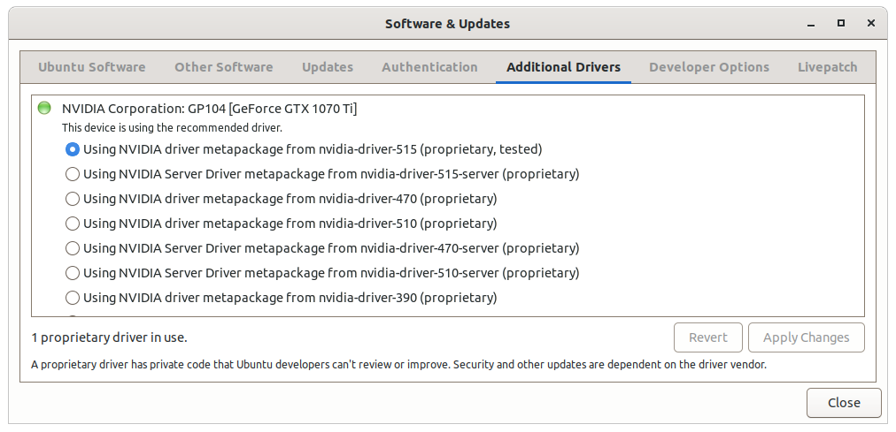

# TensorFlow GPU Installation on Ubuntu

While installing TensorFlow in a conda environment is easy as in [Install TensorFlow with pip](https://www.tensorflow.org/install/pip), a system-wide installation is much more involved.
This note walks through the steps to install a system-wide TensorFlow with GPU.\
At the time of this writing, the software requirements are
> NVIDIA® GPU drivers version 450.80.02 or higher.\
> CUDA® Toolkit 11.2.\
> cuDNN SDK 8.1.0.

## Step 1 - NVIDIA Driver
The first step is to install the NVIDIA driver. On more recently Ubuntu version, this is easy. Simply open "Software & Updates", navigate to the "Additional Drivers" tab and choose the latest NVIDIA driver as shown below.


## Step 2 - CUDA
Download cuda_11.2.0_460.27.04_linux.run from [https://developer.nvidia.com/cuda-toolkit-archive](https://developer.nvidia.com/cuda-toolkit-archive). Install CUDA by running the file. Since the NVIDIA driver is already installed in the above step, choose not to install driver during the installation process as shown below.


After CUDA is installed, add the following lines to .bashrc
```bash
export PATH=$PATH:/usr/local/cuda-11.2/bin
export LD_LIBRARY_PATH=$LD_LIBRARY_PATH:/usr/local/cuda-11.2/lib64
```

## Step 3 - cuDNN
Download cudnn-11.2-linux-x64-v8.1.0.77.tgz from [https://developer.nvidia.com/cudnn](https://developer.nvidia.com/cudnn). Extract it and copy everything in 

## Step 4 - TensorFlow
Install with
> pip install tensorflow
and verify the installation by
> python -c "import tensorflow as tf; print(tf.config.list_physical_devices('GPU'))"

## References
[Install TensorFlow with pip](https://www.tensorflow.org/install/pip)

[Back to Contents](../README.md)
