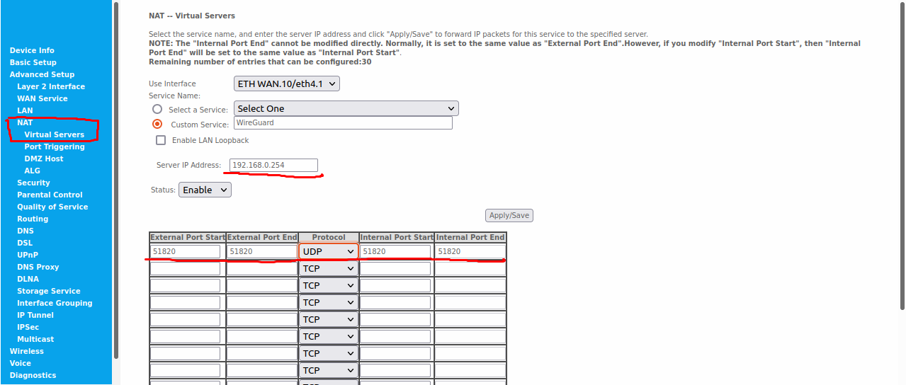

# WireGuard Setup

This note walks through the steps to set up a WireGuard server on a home computer in a home network so that a client device away from home can access the home network and also be able to direct the internet traffic through the WireGuard server.

## Home Network Environment
Here we suppose the home network consists of a home router and several devices connected to it. Let us assume the following:
- The public IP of the router is *101.92.31.37*
- The devices on the LAN of the router are assigned local IP's with DHCP
- The LAN IP range is *192.168.0.0/24*
- The WireGuard server is assigned a static LAN IP of *192.168.0.254* by the home router

## Port Forwarding
Before we start setting up the WireGuard server and clients, port forwarding need to be set up on the home router so that a client device away from home can connect to the WireGuard server behind the home router. The default port for WireGuard is *51820/UDP*. Here we need internet traffic to 101.92.31.37/51820 be directed to 192.168.0.254/51820. Below is an example of setting the port forwarding on a home router


## WireGuard Installation
The WireGuard tools need to be installed on both the server and the client devices. For Ubuntu 20, it can be installed simply by the following commands
```bash
sudo apt update && sudo apt install wireguard
```

## WireGuard Server
### Key Generation
The private key and the public key of the server have to be generated before we can set up server configuration file. Use the following commands to generate the private and public keys:
```bash
sudo -i
cd /etc/wireguard
umask 077
wg genkey > private.key
wg pubkey < private.key > public.key
```
Now the files *private.key* and *public.key* in the */etc/wireguard/* folder contain the private key and the public key of the server respectively.

### Server Configuration File
Create the server configuration file *wg0.conf* in the folder */etc/wireguard/*
```bash
touch /etc/wireguard/wg0.conf
```
This file will be used to create the wg0 interface by WireGuard later. Add the following lines
```
[Interface]
Address = 192.168.1.1/24
ListenPort = 51820
```
Here we give the server an IP of 192.168.1.1 in the VPN. The */24* is a CIDR mask and means that the server will relay other traffic in the 192.168.1.1-192.168.1.254 range to peers in the VPN. It also gives us the potential to have 253 clients.

## WireGuard Client
### Key Generation
### Client Configuration File

[Back to Contents](../README.md)
