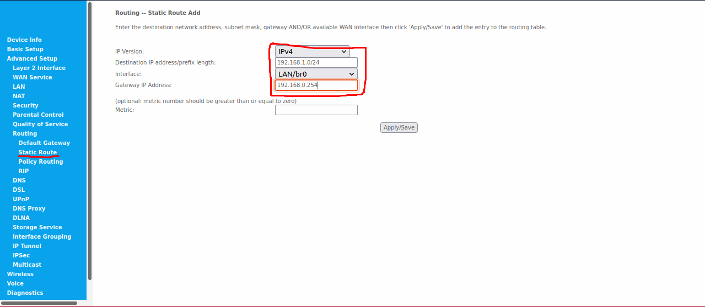

# WireGuard Setup

This note walks through the steps to set up a WireGuard server on a home computer in a home LAN so that a client device away from home can access the home LAN and also be able to direct the internet traffic through the WireGuard VPN.

## Home LAN Environment
Here we suppose the home LAN consists of a home router and several devices connected to it. Let us assume the following:
- The public IP of the router is **101.92.31.37**
- The devices on the LAN of the router are assigned local IP's with DHCP
- The LAN IP range is **192.168.0.0/24**
- The WireGuard server is assigned a static LAN IP of **192.168.0.254** by the home router

## Port Forwarding, Firewall, and IP Forwarding
Before we start setting up the WireGuard server and clients, port forwarding need to be set up on the home router so that a client device away from home can connect to the WireGuard server behind the home router. The default port for WireGuard is **51820/UDP**. Here we need internet traffic to 101.92.31.37/51820 be directed to 192.168.0.254/51820. Below is an example of setting the port forwarding on a home router

To make sure incoming connections reach the server, we also need to open the port in the firewall of the server. On Ubuntu 20, simply use the following command
```bash
sudo ufw allow 51820/udp
```
Most of the time, we will have multiple clients connected to the WireGuard server. If we want to connect from one client to another, it requires the server to relay the traffic. IP forwarding needs to be enabled on the server for this to work. Open the file **/etc/sysctl.conf** on the server and uncomment the line for **net.ipv4.ip_forward=1**. To apply the setting, we must use the following:
```bash
sudo sysctl -p
```
This will make our above setting permanent.

## WireGuard Installation
The WireGuard tools need to be installed on both the server and the client devices. For Ubuntu 20, it can be installed simply by the following commands
```bash
sudo apt update && sudo apt install wireguard
```

## WireGuard Server
### Key Generation
The private key and the public key of the server have to be generated before we can set up server configuration file. Use the following commands to generate the private and public keys:
```bash
sudo -i
cd /etc/wireguard
umask 077
wg genkey > private.key
wg pubkey < private.key > public.key
```
Now the files *private.key* and *public.key* in the */etc/wireguard/* folder contain the private key and the public key of the server respectively.

### Server Configuration File
Create the server configuration file *home-vpn.conf* in the folder */etc/wireguard/*
```bash
touch /etc/wireguard/home-vpn.conf
```
This file will be used to create the home-vpn digital network interface by WireGuard later. Add the following lines
```
[Interface]
Address = 192.168.1.1/24
ListenPort = 51820
```
Here we give the server an IP of 192.168.1.1 in the VPN. The */24* is a CIDR mask and means that the server will relay other traffic in the 192.168.1.1-192.168.1.254 range to peers in the VPN. It also gives us the potential to have 253 clients. Note that you can choose any set of IP's in the private IP ranges (192.168.0.0/16, 10.0.0.0/8, 172.16.0.0/12).\
Now we add the server private key to the file
```bash
echo "PrivateKey = $(cat /etc/wireguard/private.key)" >> /etc/wireguard/home-vpn.conf
```
At this point, our *home-vpn.conf* will like this (with different keys)
```
[Interface]
Address = 192.168.1.1/24
ListenPort = 51820
PrivateKey = YIHEAqPWDJh2DsCrsDltwtRsBuxm7lEjwF8UOEcvxkM=
```
For now let us log out of the root account by using **Ctrl+D**.

## WireGuard Client
We will create the client keys and configuration file on the server. If the client is also a device running Ubuntu 20 or a similar Linux distribution, this can also be done on the client device.
### Key Generation
First we create a folder for keeping the keys and the configuration file.
```bash
cd ~
umask 077
mkdir .wireguard && cd .wireguard
mkdir client1 && cd client1
```
Generate the keys of the client with the following commands
```bash
wg genkey > private.key
wg pubkey < private.key > public.key
wg genpsk > psk
```
The new piece here is the **Pre-Shared Key (PSK)**. The PSK is optional, but adds significant security and is very easy to add.

### Client Configuration File
Now create the client configuration file *home-vpn.conf* in the folder *~/.wireguard/client1/* and add the following two lines
```
[Interface]
Address = 192.168.1.2/32
```
We assigned the IP *192.168.1.2* to the client in the VPN. Add the client private key:
```bash
echo "PrivateKey = $(cat ~/.wireguard/client1/private.key)" >> ~/.wireguard/client1/home-vpn.conf
```
Now add the server connection details:
```bash
echo "[Peer]" >> ~/.wireguard/client1/home-vpn.conf
echo "Endpoint = 101.92.31.37:51820" >> ~/.wireguard/client1/home-vpn.conf
echo "AllowedIPs = 192.168.1.0/24" >> ~/.wireguard/client1/home-vpn.conf
echo "PublicKey = $(sudo cat /etc/wireguard/public.key)" >> ~/.wireguard/client1/home-vpn.conf
echo "PresharedKey = $(cat ~/.wireguard/client1/psk)" >> ~/.wireguard/client1/home-vpn.conf
```
At this stage, the client configuration file *~/.wireguard/client1/home-vpn.conf* looks like below (with different keys):
```
[Interface]
Address = 192.168.1.2/32
PrivateKey = cD+NoV94mw7SnjOU1VTHdH6GACie8mr/VDPXXY3oI1E=

[Peer]
Endpoint = 101.92.31.37:51820
AllowedIPs = 192.168.1.0/24
PublicKey = U2oRFamuEDrOB8eds1ETQWE3nUh7VYoGvDZV0HU8lm0=
PresharedKey = GZ159PGs59WQOj5Z+SQszPz995TcERHmK3DknuQoqU=
```
The *[Interface]* section specifies the IP of the client in the VPN and contains the private key of the client. The client has one peer, which is the server, and the *[Peer]* section contains the connection details of the server. **Endpoint** is the public IP address and port number with which our client device can reach the server. **AllowedIPs** specifies the IP's the client can access through the server. It behaves as a sort of routing table when sending and a sort of access control list when receiving. *PublicKey* in the *[Peer]* section is the public key of the peer (the server here). Finally we have the **PresharedKey** for the connection between the client and the server.

### Client in Server Configuration File
For the client to connect, the server needs to know that the client is allowed to connect. We need to add the client as a *[Peer]* in the server configuration file:
```bash
sudo -i
echo "[Peer]" >> /etc/wireguard/home-vpn.conf
echo "AllowedIPs = 192.168.1.2/32" >> /etc/wireguard/home-vpn.conf
echo "PublicKey = $(cat /home/user/.wireguard/client1/public.key)" >> /etc/wireguard/home-vpn.conf
echo "PresharedKey = $(cat /home/user/.wireguard/client1/psk)" >> /etc/wireguard/home-vpn.conf
```
Make sure to change *user* to your user name so that the file path points to the correct file. Log out of the root account by **Ctrl+D** after this is done.\
Now the server configuration file */etc/wireguard/home-vpn.conf* should look like (with different keys):
```
[Interface]
Address = 192.168.1.1/24
ListenPort = 51820
PrivateKey = YIHEAqPWDJh2DsCrsDltwtRsBuxm7lEjwF8UOEcvxkM=

[Peer]
AllowedIPs = 192.168.1.2/32
PublicKey = la8he+5YpXJRhJKYDLmrt8/vE4q0t06P5EfqUmgr31s=
PresharedKey = GZ159PGs59WQOj5Z+SQszPz995TcERHmK3DknuQoqU=
```

This finishes creating the configuration of a WireGuard client. Additional clients can be add by following the same steps and appending to the server configuration file.

## Running the Server
To bring up the server, simply use the command:
```bash
sudo wg-quick up home-vpn
```
This creates a digital network interface *home-vpn*.\
To stop the serve, use
```bash
sudo wg-quick down home-vpn
```
To enable the service at system boot, use the command:
```bash
sudo systemctl enable wg-quick@home-vpn
```
The status of the WireGuard server can be shown by
```bash
sudo wg show
```

## Connecting to the Server
Now that we have created the client configuration file, we can copy the file onto a client device and use it to establish a connection to the server. If the client device is a mobile phone, install the WireGuard app and load the client configuration file into it. Then it will be very straightforward to enable the VPN connection.\
If the client device is a computer running Ubuntu 20 or a similar Linux distribution, copy the client configuration file to the **/etc/wireguard/** directory of the device and use the same **wg-quick** commands to establish and close the connection. Once the VPN connection is established, the client device can connect to the server and other clients on the same VPN.

## Accessing the Home LAN
We have restricted the client to be only able to access the peers in the VPN (192.168.1.0/24) through the VPN connection. We can allow the VPN clients to access the devices in the home LAN but not connected to the WireGuard VPN by changing the **AllowedIPs** to include *192.168.0.0/24*. After the change, the client configuration files looks like:
```
[Interface]
Address = 192.168.1.2/32
PrivateKey = cD+NoV94mw7SnjOU1VTHdH6GACie8mr/VDPXXY3oI1E=

[Peer]
Endpoint = 101.92.31.37:51820
AllowedIPs = 192.168.0.0/23
PublicKey = U2oRFamuEDrOB8eds1ETQWE3nUh7VYoGvDZV0HU8lm0=
PresharedKey = GZ159PGs59WQOj5Z+SQszPz995TcERHmK3DknuQoqU=
```
Now a client can access the IP's in the range 192.168.0.0-192.168.1.255 through the VPN connection. There is one more piece to make this work. The devices in the home LAN and not in the WireGuard VPN need to know where to send to the IP's in the range *192.168.1.0/24*. We will add a static route in the home router. Below show an example of the router setting:


## Accessing the Internet
We can further allow the clients to direct all their internet traffic through the VPN connection. In the client configuration file, simply change the **AllowedIPs** to **0.0.0.0/0**. In the server configuration file, add the following two line in the *[Interface]* section:
```
PostUp = iptables -t nat -A POSTROUTING -m iprange ! --dst-range 192.168.0.0-192.168.1.255 -o eth0 -j MASQUERADE
PostDown = iptables -t nat -D POSTROUTING -m iprange ! --dst-range 192.168.0.0-192.168.1.255 -o eth0 -j MASQUERADE
```
We are passing the traffic through the device "eth0". This is the network device the server uses to connect to the internet. To see which device the server uses to connect to the internet, use
```bash
ip -o -4 route list default | cut -d" " -f5
```
The option *"-m iprange ! --dst-range 192.168.0.0-192.168.1.255"* tells the server not to NAT the traffic directed to the home LAN or the WireGuard VPN.\
At this stage, the server configuration file and the client configuration file look like (with different keys):
```
[Interface]
Address = 192.168.1.1/24
ListenPort = 51820
PrivateKey = YIHEAqPWDJh2DsCrsDltwtRsBuxm7lEjwF8UOEcvxkM=
PostUp = iptables -t nat -A POSTROUTING -m iprange ! --dst-range 192.168.0.0-192.168.1.255 -o eth0 -j MASQUERADE
PostDown = iptables -t nat -D POSTROUTING -m iprange ! --dst-range 192.168.0.0-192.168.1.255 -o eth0 -j MASQUERADE

[Peer]
AllowedIPs = 192.168.1.2/32
PublicKey = la8he+5YpXJRhJKYDLmrt8/vE4q0t06P5EfqUmgr31s=
PresharedKey = GZ159PGs59WQOj5Z+SQszPz995TcERHmK3DknuQoqU=
```
```
[Interface]
Address = 192.168.1.2/32
PrivateKey = cD+NoV94mw7SnjOU1VTHdH6GACie8mr/VDPXXY3oI1E=

[Peer]
Endpoint = 101.92.31.37:51820
AllowedIPs = 0.0.0.0/0
PublicKey = U2oRFamuEDrOB8eds1ETQWE3nUh7VYoGvDZV0HU8lm0=
PresharedKey = GZ159PGs59WQOj5Z+SQszPz995TcERHmK3DknuQoqU=
```

## Extra Settings
### Custom DNS
Add the following line to the *[Interface]* section of the client configuration file to use a custom DNS.
```
DNS = x.x.x.x
```

### PersistentKeepalive
When a client is behind NAT or a firewall, the connection to the WireGuard server may no long be valid after the client has gone silent for a while. If the client wishes to receive incoming packets even when it is not sending any packets, the NAT/firewall mapping must be kept valid. The following line needs be added to the *[Peer]* section in the client configuration file:
```
PersistentKeepalive = 25
```
This setting makes the client periodically send keepalive packets every 25 seconds.

## References
[WireGuard Quick Start](https://www.wireguard.com/quickstart/)\
[Complete Wireguard Setup in 20 min – Better Linux VPN Server](https://www.smarthomebeginner.com/linux-wireguard-vpn-server-setup/)\
[How to Set Up WireGuard VPN on Ubuntu 20.04](https://linuxize.com/post/how-to-set-up-wireguard-vpn-on-ubuntu-20-04/)\
[How To Set Up WireGuard on Ubuntu 20.04](https://www.digitalocean.com/community/tutorials/how-to-set-up-wireguard-on-ubuntu-20-04)

[Back to Contents](../README.md)
